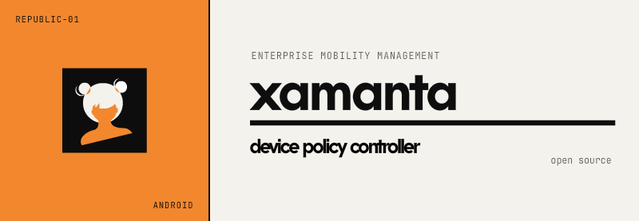

 

    
  </a>
 

A free and open-source platform that replicates the functional core of a DPC alongside an [EMM server](https://github.com/aeri/XamantaSDK), while respecting users’ freedom and privacy.

Currently, Xamanta can do the following:
* **Provisioning**: Obtain an application that acts as the Device Owner on the device and provision it through the official *QR/NFC* workflows.
* **Policy Enforcement**: Apply user restrictions, install applications in unattended mode, and manage permissions.
* **Kiosk Mode**: Lock a specific application in a stable state from which it cannot be exited and which is resistant to reboot loops and failures.
* **Remote Commands**: Execute specific actions (lock, wipe, reboot, etc.) in an idempotent manner and decoupled from the transport layer.
* **Self-Update**: Allow Xamanta to update itself silently
and unattended

> [!WARNING]  
> The development is currently in the beta phase and requires testing before it can be used in production.
